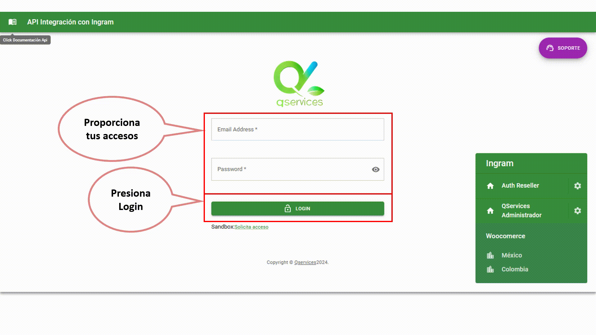

# Admin Ingram

This app provide a login page. It is done with:

  - React
  - Node
  - Api
  - FrontEnd - Admin
  - Cron
  - Typescript
  - MUI 
  - Hooks
  - Prisma
  - Postgresql
  - Heroku
  - AWS

The final version can be found here: https://admin.shopintegrate.net

<p align="center">
    <a target="_blank" href="https://admin.shopintegrate.net">
      
    </a>
</p>

## Instalation

**You need to install [Node.js](https://nodejs.org/en/download/)**

```git clone https://github.com/JoseVQuintero/Admin-Ingram-Integration-Api-React-Node.git```

SSH URLs provide access to a Git repository via SSH, a secure protocol. If you have a SSH key registered in your Github account, clone the project using this command:

```git clone git@github.com:JoseVQuintero/Admin-Ingram-Integration-Api-React-Node.git```

### Install dependencies

After clone, install the dependencies and devDependencies.

```sh
$ cd Admin-Ingram-Integration-Api-React-Node
$ npm install
```

Run the following command in order to start the application in a development environment:

```npm run dev```